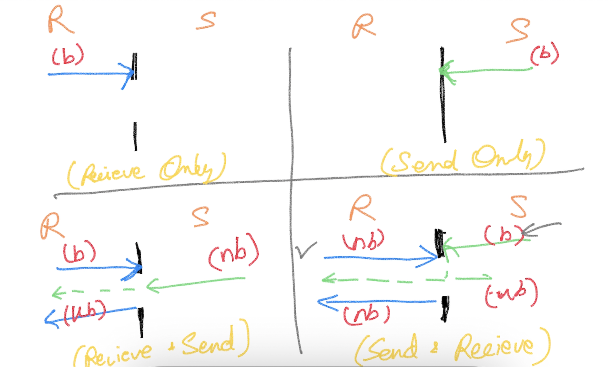

# Concurrency #

**Concurrency**
    - Ability to have more than one execution path
    
**Parallelism**
    - "Executing" more than one execution path at the "same time"

### To detect Data Race ###
    - go run -race <program.go>
    - go build -race -o <bindary_name> <program.go>

### Communication between goroutines ###
- channel data type (chan)
- declaration
```
    var ch chan int
```
- Initialization
```
    ch = make(chan int)
```
- Operations (using **<-** operator)
    - Send Operation
    ```
        ch <- 100
    ```
    - Receive Operation
    ```
        var data = <-ch
    ```

### Channel Behaviors ###
- Receive Operation
    - A receive operation is ALWAYS a blocking operation
- Send Operation
    - A "send" operation is blocked until a "receive" operation is initiated (conditions apply)

    
